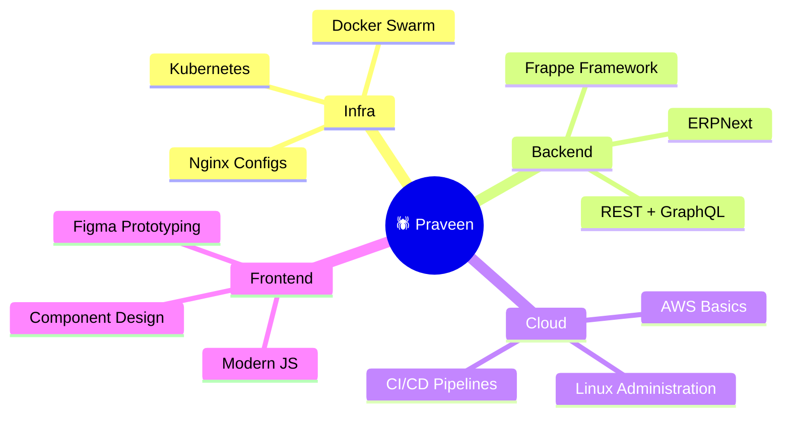

<!-- 🕸️ SPIDER-THEMED BANNER — commit assets/spidey-banner.svg to this repo for this to render -->
<p align="center">
  
</p>

<!-- TYPING SVG -->
<h1 align="center">
  
</h1>

<!-- daily patrol snake -->
<p align="center">
  
</p>

<p align="center">
  
</p>

---

<h2 align="center">🕸️ Web-Slinger Stats</h2>

<div align="center">

| 🕷️ Slinging Webs Since | 🐛 Bugs Squashed | 🚀 Missions Completed | 🌍 Mission |
|:-:|:-:|:-:|:-:|
| **2+ yrs** | **150+** | **5** | **Tech4Good** |

</div>

---

<h2 align="center">🕷️ Origin Story</h2>

<div align="center">
  
  &nbsp;
  
  &nbsp;
  
  &nbsp;
  
</div>

<br>

> *"Every great app was once just a bug report waiting to be fixed."*

### 👨‍💻 Who Am I?

Bitten by a radioactive keyboard 🕷️, I'm **Praveen** — a **Fullstack Developer**, **Open Source Contributor**, and **Tech4Good Fellow** who swings between frontend and backend building systems that spark real-world impact.

### 🔥 What I Do

- 🚀 Currently building: **Open-source ERP, Zoho Books–like systems**
- 🕸️ Learning: **Frappe, Kubernetes, DevOps, Cloud Architecture**
- 🛠️ Interested in: **Automation, scalable backends, infra engineering**
- 🎯 Mission: *"Tech that empowers people."*
- 🌐 Portfolio: [praveeny.gamer.gd](https://praveeny.gamer.gd)
- 📧 Reach me: jaga03038@gmail.com

---

<h2 align="center">🕸️ Spidey-Sense Skill Levels</h2>

<div align="center">

| Skill | Spidey-Sense |
|---|---|
| JavaScript / Node.js | `████████░░` 88% |
| Python | `████████░░` 80% |
| MySQL / PostgreSQL | `████████░░` 82% |
| Docker / Kubernetes | `███████░░░` 70% |
| Linux / Nginx | `████████░░` 85% |
| Figma / UI Design | `██████░░░░` 65% |

</div>

<p align="center">
  
</p>

<h2 align="center">🕸️ My Web (Tech Stack)</h2>

<div align="center">
  
</div>

---

<h2 align="center">📅 Web-Slinging Chronicles</h2>

<div align="center">

```
2024 – present  🕸️━━━  Open-source ERP system         [Frappe · Python · PostgreSQL]
2024            🕸️━━━  Zoho Books–like billing module  [Node.js · PostgreSQL · Redis]
2023            🕸️━━━  Tech4Good fellowship platform   [Impact tech · Fullstack]
2023            🕸️━━━  Personal portfolio site         [praveeny.gamer.gd]
```

</div>

---

<h2 align="center">🕷️ Training Arc</h2>

<div align="center">



</div>

---

<h2 align="center">📊 Web Analytics HQ</h2>

<div align="center">
  
  
</div>

<p align="center">
  
</p>

<p align="center">
  
</p>

---

<h2 align="center">🏆 Trophy Room</h2>

<p align="center">
  
</p>

---

<h2 align="center">🔢 Mission Control</h2>

<p align="center">
  
  &nbsp;
  
  &nbsp;
  
</p>

---

<p align="center">
  
</p>

<h2 align="center">📞 Signal the Web-Head</h2>

<p align="center">
  <a href="https://linkedin.com/in/praveeny"></a>
  &nbsp;&nbsp;
  <a href="https://instagram.com/tebi_messi_13"></a>
  &nbsp;&nbsp;
  <a href="mailto:jaga03038@gmail.com"></a>
</p>

<p align="center">
  <i>Open to collaborations, open source contributions, and building things that matter — with great code comes great responsibility. 🕸️</i>
</p>
