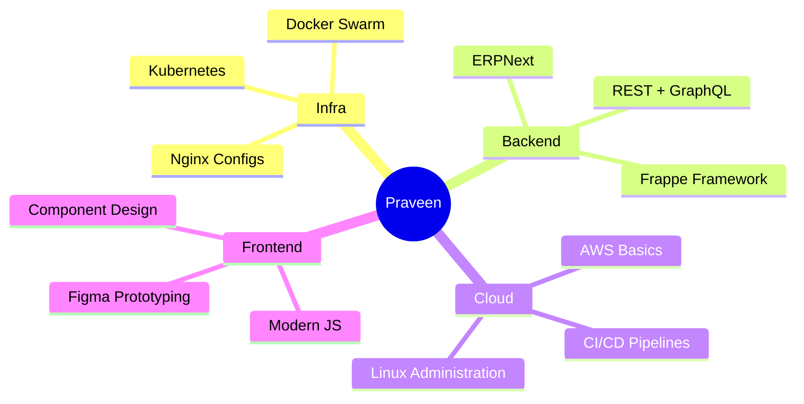

<!-- HERO -->
<h1 align="center">
  
</h1>

<p align="center">
  
</p>

<p align="center">
  
</p>

---

<!-- QUICK STATS -->
<h2 align="center">⚡ At a Glance</h2>

<div align="center">

| 🧑‍💻 Years Building | 🔀 Open Source PRs | 🚀 Live Projects | 🌍 Mission |
|:-:|:-:|:-:|:-:|
| **2+** | **12+** | **5** | **Tech4Good** |

</div>

---

<!-- ABOUT -->
<h2 align="center">✨ About Me</h2>

<div align="center">
  
  &nbsp;
  
  &nbsp;
  
  &nbsp;
  
</div>

<br>

> *"Tech that empowers people — not replaces them."*

### 👨‍💻 Who Am I?

I am **Praveen**, a passionate **Fullstack Developer**, an enthusiastic **Open Source Contributor**, and a **Tech4Good Fellow** who loves building systems that *spark real-world impact*.

### 🔥 What I Do

- 🚀 Currently building: **Open-source ERP, Zoho Books–like systems**
- 🧠 Learning: **Frappe, Kubernetes, DevOps, Cloud Architecture**
- 🛠️ Interested in: **Automation, scalable backends, infra engineering**
- 🎯 Mission: *"Tech that empowers people."*
- 🌐 Portfolio: [praveeny.gamer.gd](https://praveeny.gamer.gd)
- 📧 Reach me: jaga03038@gmail.com

---

<!-- SKILL PROFICIENCY -->
<h2 align="center">🧠 Skill Proficiency</h2>

<div align="center">

| Skill | Proficiency |
|---|---|
| JavaScript / Node.js | `████████░░` 88% |
| Python | `████████░░` 80% |
| MySQL / PostgreSQL | `████████░░` 82% |
| Docker / Kubernetes | `███████░░░` 70% |
| Linux / Nginx | `████████░░` 85% |
| Figma / UI Design | `██████░░░░` 65% |

</div>

---

<!-- DIVIDER -->
<div align="center">
  
</div>

<!-- TECH STACK -->
<h2 align="center">⚡ Tech Stack</h2>

<div align="center">
  
</div>

---

<!-- PROJECT TIMELINE -->
<h2 align="center">🗂️ Project Timeline</h2>

<div align="center">

```
2024 – present  ●━━━  Open-source ERP system         [Frappe · Python · PostgreSQL]
2024            ●━━━  Zoho Books–like billing module  [Node.js · PostgreSQL · Redis]
2023            ●━━━  Tech4Good fellowship platform   [Impact tech · Fullstack]
2023            ●━━━  Personal portfolio site         [praveeny.gamer.gd]
```

</div>

---

<!-- CURRENTLY LEARNING -->
<h2 align="center">📡 Currently Exploring</h2>

<div align="center">



</div>

---

<!-- GITHUB ANALYTICS -->
<h2 align="center">📊 GitHub Analytics</h2>

<div align="center">
  
  
  
</div>

---

<!-- ACTIVITY GRAPH -->
<h2 align="center">📈 Contribution Activity</h2>

<p align="center">
  
</p>

---

<!-- TROPHIES -->
<h2 align="center">🏆 Achievements & Trophies</h2>

<p align="center">
  
</p>

---

<!-- PROFILE VIEWS + BADGES -->
<h2 align="center">🔢 Profile Stats</h2>

<p align="center">
  
  &nbsp;
  
  &nbsp;
  
</p>

---

<!-- FOOTER WAVE -->
<p align="center">
  
</p>

<!-- CONNECT -->
<h2 align="center">🤝 Connect with Me</h2>

<p align="center">
  <a href="https://linkedin.com/in/praveeny"></a>
  &nbsp;&nbsp;
  <a href="https://instagram.com/tebi_messi_13"></a>
  &nbsp;&nbsp;
  <a href="mailto:jaga03038@gmail.com"></a>
</p>

<p align="center">
  <i>Open to collaborations, open source contributions, and building things that matter.</i>
</p>
