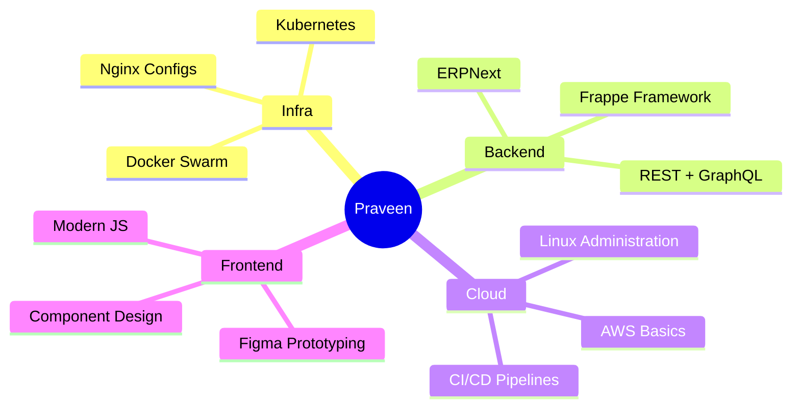

<!-- ================================================================
  Praveen — GitHub Profile README (v2: more motion + images)
  Only custom asset needed: ./assets/divider.svg (included alongside this file).
  All GIF/PNG links point to GitHub's own permanent user-images CDN, so
  nothing needs to be uploaded or committed by you besides the divider.
================================================================= -->

<div align="center">


</div>

<table width="100%">
<tr>
<td width="62%" valign="middle">


<br/>


</td>
<td width="38%" align="center">


</td>
</tr>
</table>


##  About Me

<table width="100%">
<tr>
<td width="65%" valign="top">

- 🧑‍💻 Fullstack developer building systems that are actually used, not just shipped
- 🏗️ Currently building an **open-source ERP** — a Zoho Books–style billing/accounting system
- 🌱 Learning **Frappe, Kubernetes, and cloud-native architecture**
- 🎯 Tech4Good Fellow — focused on tech that empowers people, not just impresses recruiters
- 🌐 Portfolio: **[praveeny.gamer.gd](https://praveeny.gamer.gd)**
- 📫 Reach me: **jaga03038@gmail.com**

</td>
<td width="35%" align="center">


</td>
</tr>
</table>

<div align="center">

</div>


##  Tech Stack

<div align="center">

</div>
<br/>

<details open>
<summary><b>💻 Languages</b></summary>
<br/>

</details>

<details>
<summary><b>⚙️ Backend & Frameworks</b></summary>
<br/>

</details>

<details>
<summary><b>🗄️ Databases</b></summary>
<br/>

</details>

<details>
<summary><b>☁️ DevOps & Infra</b></summary>
<br/>

</details>

<details>
<summary><b>🎨 Design</b></summary>
<br/>

</details>


## 🧠 How I Think About Tech



<div align="center">

</div>


##  What I'm Building

<table width="100%">
<tr>
<td width="70%" valign="top">

```yaml
2024 - present: Open-source ERP system          # Frappe · Python · PostgreSQL
2024:           Billing & invoicing module       # Node.js · PostgreSQL · Redis
2023:           Tech4Good fellowship platform     # Impact tech · Fullstack
2023:           Personal portfolio site           # praveeny.gamer.gd
```

</td>
<td width="30%" align="center">


</td>
</tr>
</table>


##  GitHub Analytics

<div align="center">


</div>

<div align="center">

</div>

<div align="center">

</div>

<!-- Contribution snake — requires .github/workflows/snake.yml (see GitHub's own
     "platane/snk" action) to generate this output branch once, then it self-updates daily -->
<div align="center">

</div>

<div align="center">

</div>

<div align="center">

</div>


##  Let's Connect

<div align="center">

<a href="https://linkedin.com/in/praveeny"></a>
<a href="https://instagram.com/tebi_messi_13"></a>
<a href="mailto:jaga03038@gmail.com"></a>
<a href="https://praveeny.gamer.gd"></a>

<br/><br/>


<br/>

<i>Open to collaborations, open-source contributions, and building things that matter.</i>

</div>


